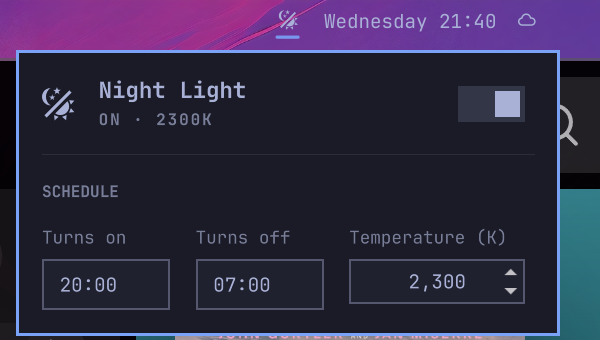

# Night Light

Omarchy bar widget for the built-in night light (hyprsunset): on/off switch and an editable schedule, next to the clock.



- Click the icon to open the panel; right-click to toggle without opening.
- Edit turn-on time, turn-off time, and temperature, then Apply. This writes `~/.config/hypr/hyprsunset.conf` and restarts hyprsunset.
  File access goes through `nightlight-file.pl` (Perl ships with Omarchy): the config must be a regular file, not a symlink; writes are atomic.
- **Gradual fade** eases the screen in and out instead of snapping. Turn it on and set how long it should take (5-240 minutes); the same duration is used at both ends. In both cases the time you set is when the ramp *begins*: with a 20:00 turn-on, a 07:00 turn-off and a 60 minute fade, the screen leaves 6500K at 20:00 and reaches the target by 21:00, then starts back up at 07:00 and is fully neutral at 08:00.
  The panel draws both ramps as gradient bars painted in the colours the screen will pass through. While a fade is actually running, that bar grows a marker at the current position and the temperature above it; outside a fade there is nothing to report, so neither appears.
  Switching the light off during a fade, or any time before the next fade out, stops hyprsunset rather than just setting a neutral temperature: its schedule would otherwise re-warm the screen at the next step. It is started again at the point the schedule agrees the light is off, so the following evening runs normally.
  hyprsunset holds one temperature per profile, so each fade is written out as a staircase of one-minute profiles. Steps are spaced evenly in mireds, not kelvin, so each one is the same *perceived* shift — around 5 mired for an hour-long fade, which is well under what the eye catches on a slow ramp. Either ramp is shortened automatically if it would otherwise run into the other end of the schedule.
- Changing only the temperature while the light is on applies instantly, with no flash. The hyprsunset restart it needs is deferred until the light is next off.
- The icon hides when the light is off and reveals on hover, like the stock indicators.

## Install

```bash
omarchy plugin add https://github.com/jeremylanger/omarchy-nightlight --enable
```

Optional: remove the stock night light indicator so this one takes its place. In `~/.config/omarchy/shell.json`, set `items` on the `omarchy.indicators` entry to exclude `NightLight`, then place this widget next to it:

```bash
omarchy bar move io.github.jeremylanger.nightlight --section center
```

For the schedule to run at login, make sure `~/.config/hypr/autostart.lua` has:

```lua
o.launch_on_start("hyprsunset")
```

## Remove

```bash
omarchy plugin remove io.github.jeremylanger.nightlight
```

Your `hyprsunset.conf` is left as is.

## IPC

```bash
omarchy-shell io.github.jeremylanger.nightlight open    # or close, toggle, apply
omarchy-shell io.github.jeremylanger.nightlight fade on 60   # or: fade off ""
```

## Dependencies

Omarchy (Quattro or newer), hyprsunset, and perl — all part of a stock install. No external services.

## License

MIT
